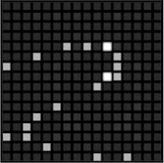

# Processing ToneMatrix

[**Original by André Michel (2000-2010)**](http://lab.andre-michelle.com/)

**Processing implementation by Matthew Hamilton (2019)**



## About

Andre Michel's [ToneMatrix]() recreated in processing with some extra frills on top. Originally at [Laboratory André Michel](http://lab.andre-michelle.com/) but now host at [AudioTool](https://www.audiotool.com/).

I loved this flash app when I was studying my undergraduate. Having taken up Processing for prototyping UIs, I wanted to try and recreate the ToneMatrix to for myself in order to learn a few concepts

## The Code

### Beat Indicator

This is simply a PGraphics canvas drawing a rectangle with a blur filter applied. It's nice for tricking the eye into thinking something has 'lit up'.


### Ripple

The ripple effect is a little bit of black magic that propagates out a colour shift when a point on the grid is triggered

Not a million miles away from a [Finite Difference Scheme](https://github.com/mhamilt/FDPlate).

### Audio

#### Audio Context

In current browsers, user interaction is required to activate the audio context

**P5js**

```js
function mousePressed() {
  getAudioContext().resume();
}
```

**WebAudio**

```html
<script>
  var AudioContext = window.AudioContext || window.webkitAudioContext;
  var audioCtx = new AudioContext();
</script>

<button onclick="soundOn()">
  WebAudio On
</button>

<script>
  function soundOn() {
    audioCtx.resume();
  }
</script>
```

#### Sine

**P5js**

```js
var osc = new p5.Oscillator();
osc.setType("sine");
osc.freq(freq);
osc.amp(0);
osc.start();
osc.amp(gain, attack);
osc.amp(gain * sustain, decay);
osc.amp(0.0, release);
```

the envelope is taken care of by the [`Oscillator.amp()`](https://p5js.org/reference/#/p5.Effect/amp).

**WebAudio**

the envelope is taken care of by [`AudioParam.linearRampToValueAtTime()`](https://developer.mozilla.org/en-US/docs/Web/API/AudioParam/linearRampToValueAtTime).

```js
var audioCtx = new (window.AudioContext || window.webkitAudioContext)();
var gainNode = audioCtx.createGain();
gainNode.connect(audioCtx.destination);
gainNode.gain.setValueAtTime(gain, audioCtx.currentTime);
var oscillator = audioCtx.createOscillator();
oscillator.type = "square";
oscillator.frequency.value = freq;
oscillator.connect(gainNode);
oscillator.start(audioCtx.currentTime);
gainNode.gain.linearRampToValueAtTime(gain, audioCtx.currentTime + attack);
gainNode.gain.linearRampToValueAtTime(
  gain * sustain,
  audioCtx.currentTime + decay
);
gainNode.gain.linearRampToValueAtTime(0.0, audioCtx.currentTime + release);
```
